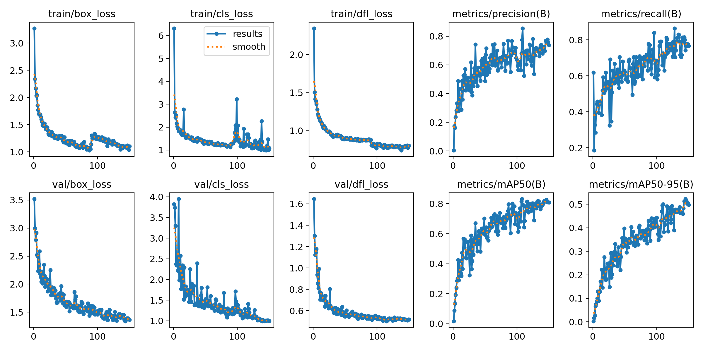
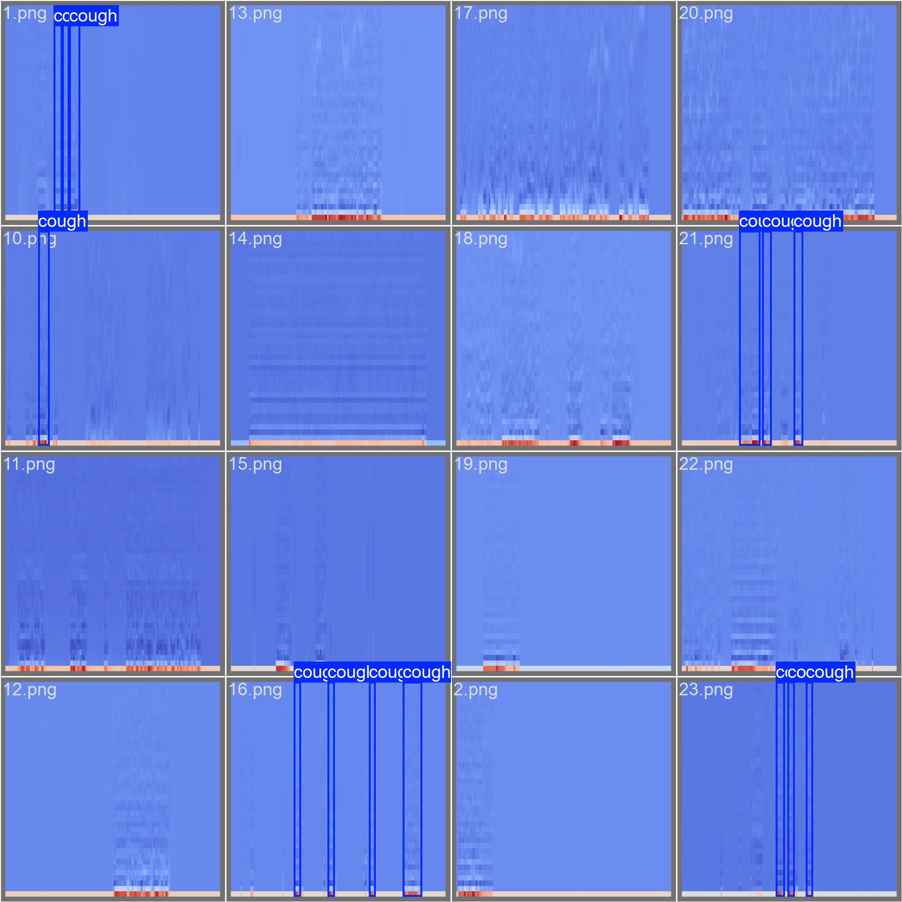
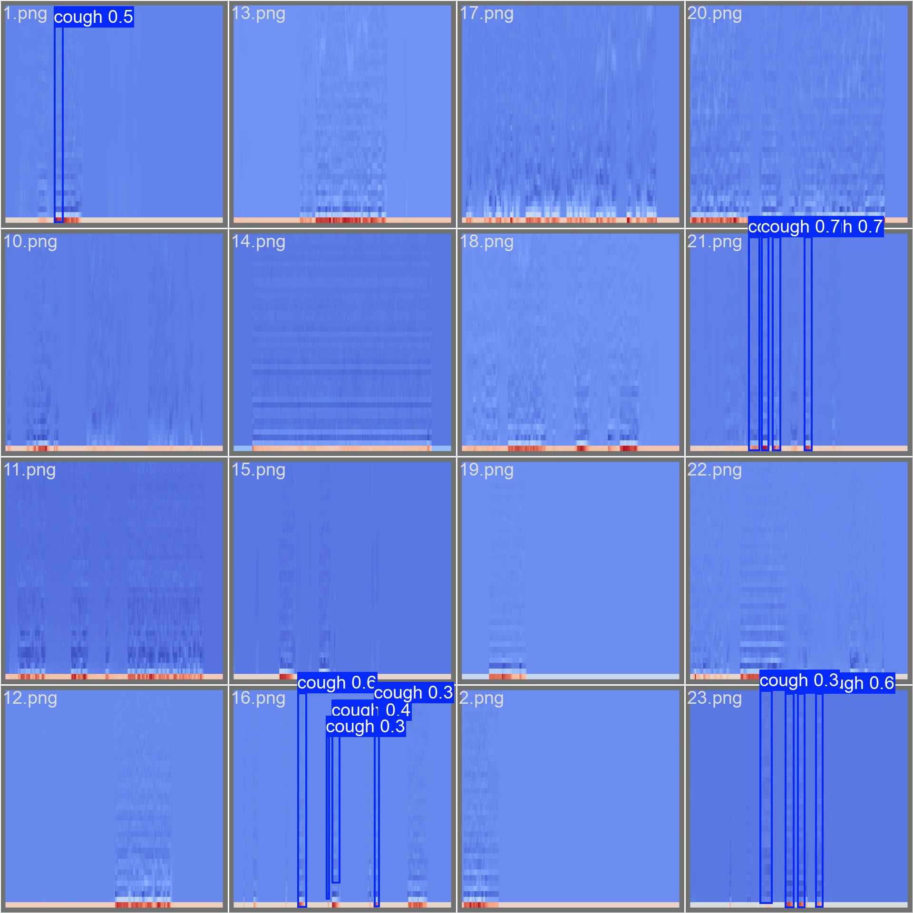

# CoughAnalyzer

## Usage
Download data with
`git clone https://github.com/roneelsharan/CoughSegmentation`

Requirements: `pip install -r requirements.txt`

Check `notebooks/EDA.ipynb` for EDA

### Adding noise
To add background noise to the audio, run `src/data/add_noise.py`with different optional flags for adding different types of noises. If you add no flags, then it will just add white noise at level 0.01. 

`--pink True` to add pink noise. Default is False 

`--brown True` to add brown noise. Default is False 

`--white_level {float}` to specify white noise level. Default is 0.01

`--pink_level {float}` to specify pink noise level. Default is 0.01 

`--brown_level {float}` to specify brown noise level. Default is 0.01

`--noise_burst_num {int}` to specify number of noise bursts. Default is 20

`--noise_burst_duration {float}` to specify the number of seconds per noise burst. Default is 1 second. 

`--beeping True` to add beeping noise. Default is False

`--talking True` to add talking noise. Default is False

Running this file will a new directory called "data_w_noise_{specifications}" that adds background noise to the original wav files. 

### Image Segmentation using Yolov8
1) Run `python src/data/gen_dataset.py` (waveform, image resized) or  `python src/data/gen_dataset_mfcc.py` (mfcc, image padded/truncated) to generate the dataset with the format as

2) Run `python src/yolo/yolo.py` to finetune Yolov8 on the cough dataset.

3) Run `python src/data/gen_dataset_inference.py` (waveform, image resized) or  `python src/data/gen_dataset_inference_mfcc.py` (mfcc, image padded/truncated) to generate the dataset for inference (real data)

4) Run `python src/yolo/inference.py` to run inference using the finetuned model on real data.

5) Model Explanations:
- `src/yolo/runs/detect/train`: 100 epochs, 640*640, waveform, image resized, 11s max length for training (any length for inference)
- `src/yolo/runs/detect/train2`: 100 epochs, 640*640, mfcc, image resized, 11s max length (any length for inference)
- `src/yolo/runs/detect/train5`: 150 epochs, 640*640, mfcc, image truncated/padded (always 11s), mosaic stopped for last 60 epochs

### Audio classification with Wav2Vec2
Generate HuggingFace dataset with `python src/data/hf_dataset.py`

Train and evaluate the model with `python src/models/wav2vec2.py`

This should give around 95% accuracy on the test set.

## Results
### Yolo Cough Detection Results
Metrics:

Validation Set Labels vs Validation Set Predictions:
<table>
  <tr>
    <td></td>
    <td></td>
  </tr>
</table>

# Using Noisy Data for Segmentation Testing:
- Clone the coughSegmentation dataset into the root of your local repository (in CoughAnalyzer/)
- Run a command like:  python3 src/data/add_noise.py \
  --white_level 0.03 \
  --noise_burst_num 10 \
  --noise_burst_duration 0.5 \
  --beeping True \
  --talking True

to generate noisy audio files. 

Similarly, simply run ./noise_to_yolo_pipeline.sh to run the entire pipeline for the YOLO model

