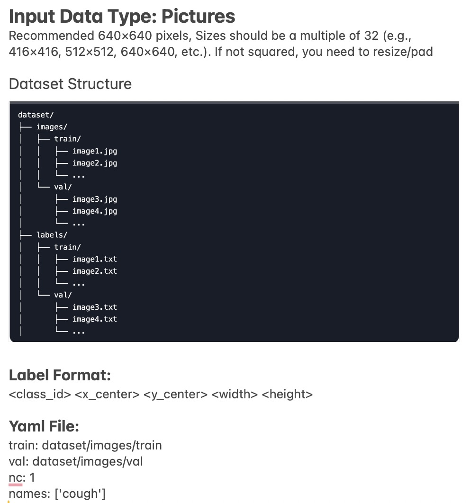
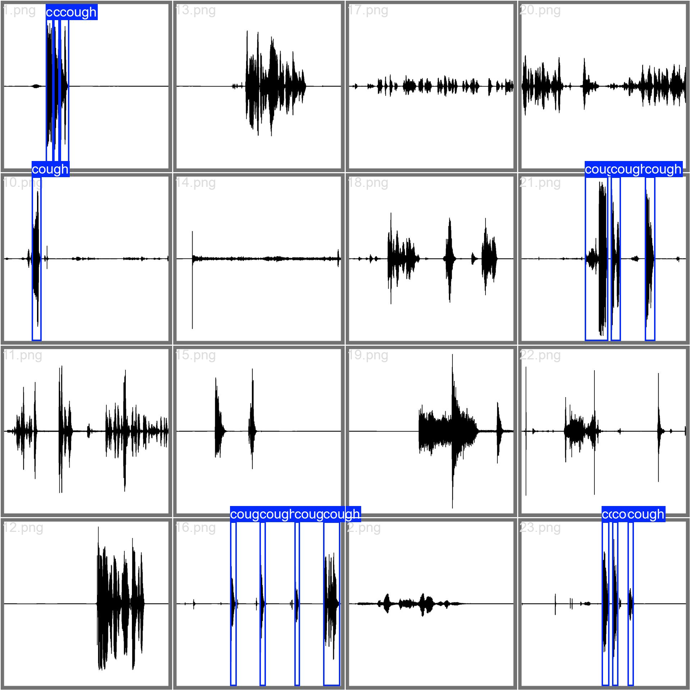
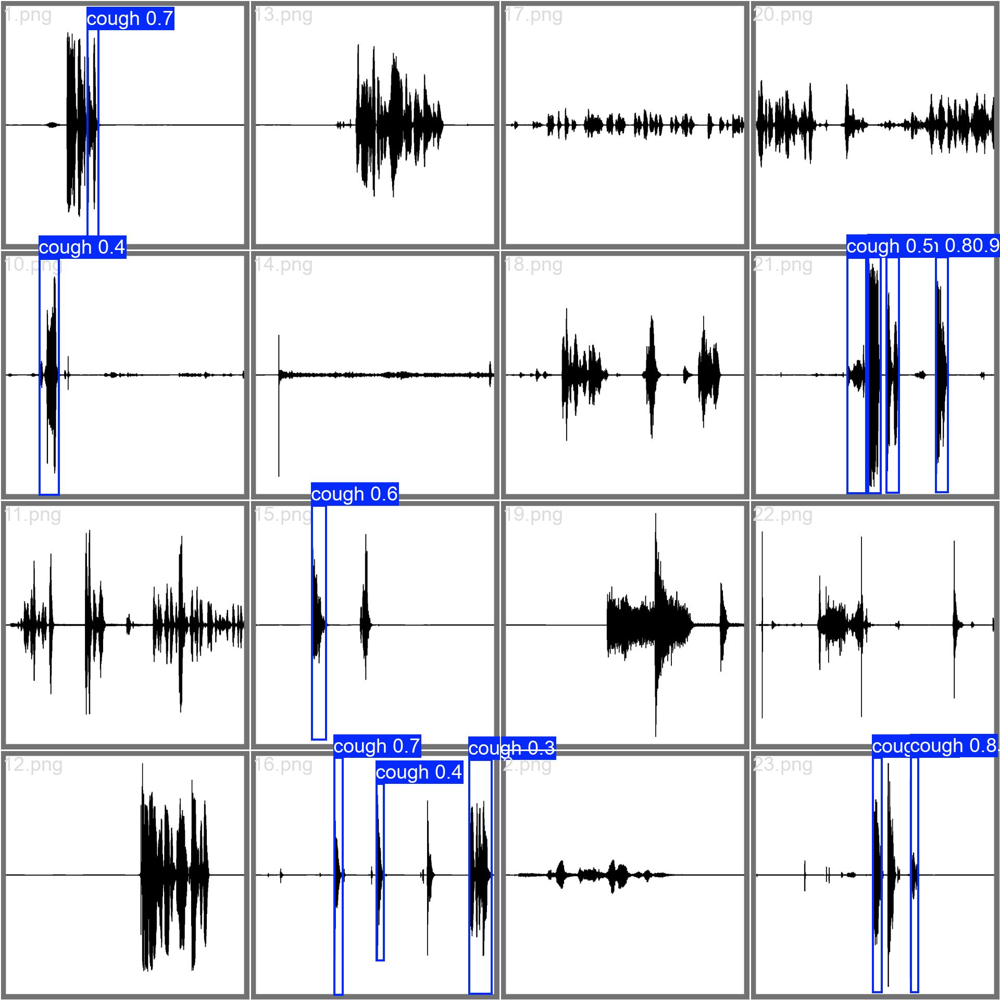

# CoughAnalyzer

## Usage
Download data with
`git clone https://github.com/roneelsharan/CoughSegmentation`

Check `notebooks/EDA.ipynb` for EDA

To add background noise to the audio, run `src/data/add_noise.py`with different optional flags for adding different types of noises. If you add no flags, then it will just add white noise at level 0.01. 

`--pink True` to add pink noise. Default is False 

`--brown True` to add brown noise. Default is False 

`--white_level {float}` to specify white noise level. Default is 0.01

`--pink_level {float}` to specify pink noise level. Default is 0.01 

`--brown_level {float}` to specify brown noise level. Default is 0.01

`--noise_burst_num {int}` to specify number of noise bursts. Default is 20

`--noise_burst_duration {float}` to specify the number of seconds per noise burst. Default is 1 second. 

`--beeping True` to add beeping noise. Default is False

`--talking True` to add talking noise. Default is False

Running this file will a new directory called "data_w_noise_{specifications}" that adds background noise to the original wav files. 

For image segmentation, run `python src/data/gen_dataset.py` to generate the dataset with format as

Requirements: `pip install -r requirements.txt`

## Yolo Cough Detection Results
Validation Set Labels:

Validation Set Predictions (conf=0.3, iou=0.4):
