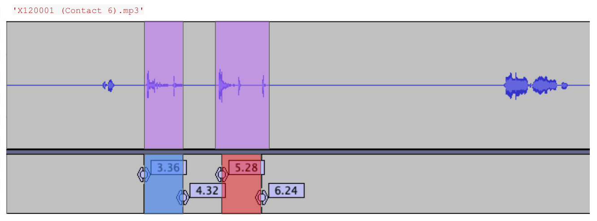

function cough_detection in cough_detection.py is able to output the start of 0.96 sec chunks that was detected by yamnet model to contain cough(s). The 0.96 seconds are innate to the yamnet model: documentation says " Internally, we frame the waveform into sliding windows of length 0.96 seconds and hop 0.48 seconds, and then run the core of the model on a batch of these frames." Thus, each frame duration is 0.96 with consecutive segments sharing 50% of the audio.

Yamnet model is a pre-trained deep learning model that outputs a predicted score for each of the 521 classes supported by the model for each of the 0.96 second frame described above. One of the 521 classes is the 'cough', which is the label that we are looking for. Some coughs, however, may also sound like some other sounds, so the model may assign the most likely label to something other than cough. So our cough segmentation model would determine that a 0.96 second frame contains cough(s) iff cough is the top `top_n` label predicted by yamnet model. To figure out what `top_n` should be, we hyperparameter tuned by running the model with different `top_n` on a validation set, looking at metrics such as recall and precision testing on synthetic data for which we have true labels (for more details, look at yamnet_evaluation.ipynb, which uses results yamnet_evaluation_cough_intervals.py to output the predicted segmentation intervals). After looking at the recall-precision trade-off, we decided on top_n = 7, so if the label 'cough' is within the top 7 labels output by the yamnet model, then our segmentation model deems that 0.96 second interval to contain cough(s).

Here are two examples below showing the model's detection.

With audio file 'X320112 (Month 20).mp3', the model returned [0.48, 0.96, 1.92, 2.4] as the starting timestamps. If we check this with the actual audio file, we can see that the coughs exits exactly where these intervals overlap for 0.48 seconds. 

in the pictures below, true coughs in purple, while blue and red are for alternating adjacent cough intervals detected by model.

With audio file 'X120001 (Contact 6).mp3', however, where the output is [3.36, 5.28], coughs are detected but is not overlapped. 

Since overlapping is not a guarantee, we always sample audio that is included in all the intervals output by the model. In other words, when the extract_cough_segments function in extract_cough_features.py translates the start timestamp of 0.96 second chunk that contains cough(s) output by cough_detection into cough intervals, we merge intervals that are overlapping, and if a certain interval has no overlap, then we include the entire 0.96 second interval as its own interval. 

After determining all of the cough intervals in extract_cough_segments, the extract_features function in extract_cough_features.py outputs the 13 features of MFCC for each audio file's cough segments. 

These 13 features on the cough segments are output for each audio file that was deemed to contain at least one cough by the segmentation model, and these features are used for clustering (see clustering method in clustering.ipynb). After performing clustering, we use UMAP to plot in 2 dimensions. We perform further clustering analysis by [NEED TO FINISH]
