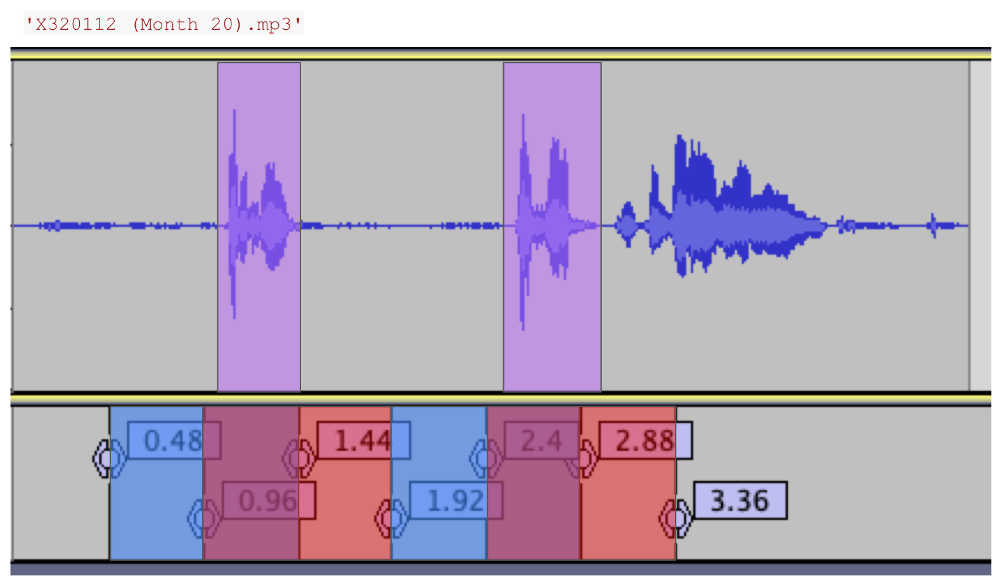

function cough_detection in cough_detection.py is able to output the start of 0.96 sec chunks that was detected by yamnet model to contain cough(s). The 0.96 seconds are innate to the yamnet model: documentation says " Internally, we frame the waveform into sliding windows of length 0.96 seconds and hop 0.48 seconds, and then run the core of the model on a batch of these frames." Thus, each frame duration is 0.96 with consecutive segments sharing 50% of the audio.

Here are two examples below showing its detection.

With audio file 'X320112 (Month 20).mp3', the model returned [0.48, 0.96, 1.92, 2.4] as the starting timestamps. If we check this with the actual audio file, we can see that the coughs exits exactly where these intervals overlap for 0.48 seconds. 

in the pictures below, true coughs in purple, while blue and red are for alternating adjacent cough intervals detected by model.

With audio file 'X120001 (Contact 6).mp3', however, where the output is [3.36, 5.28], coughs are detected but is not overlapped. 

Since overlapping is not a guarantee, we always sample audio that is included in all the intervals output by the model. 
